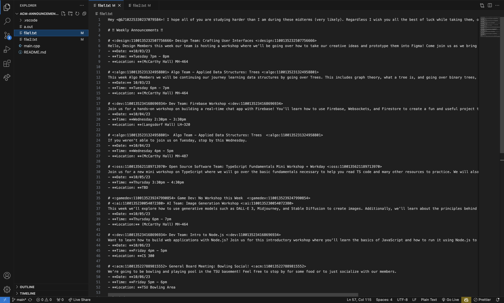
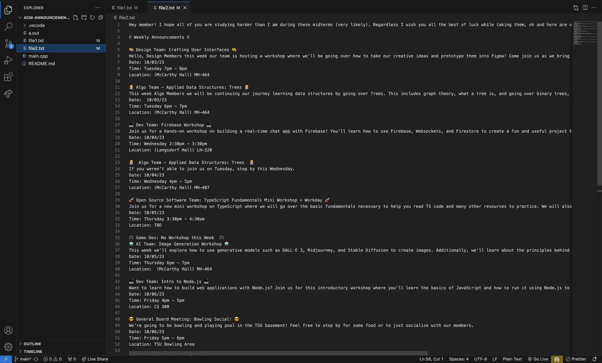
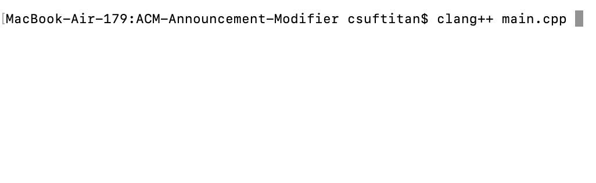
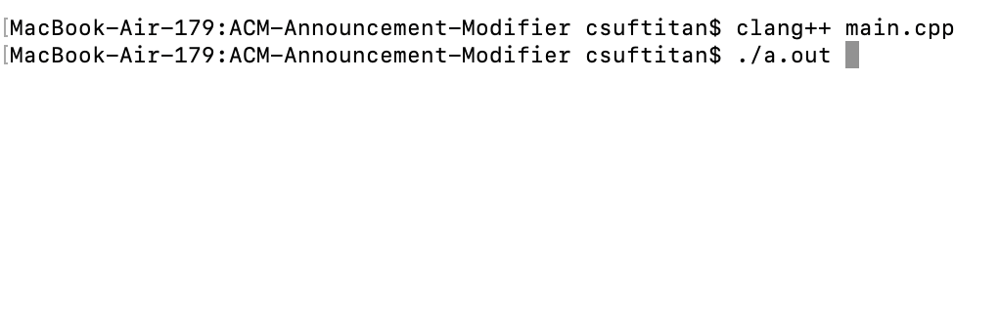

# ACM-Announcement-Modifier

Script to remove all special symbols and characters that cannot be transferred from ACM CSUF Chapter Discord Announcements to Instagram post description.

## Tools

* Languages: C++
* Libraries: fstream, regex

The fstream library allows for reading from and writing to files, and the regex library allows for manipulating text

## Example of Automation

Coverts the special symbols and characters from file1.txt:

  

to this in file2.txt:

  

## Instructions on How to Compile

Compile main.cpp using clang++ compiler:

  

Run the executable file:

  

Nice! You have converted the special symbols and characters from file1.txt to the desired text in file2.txt
